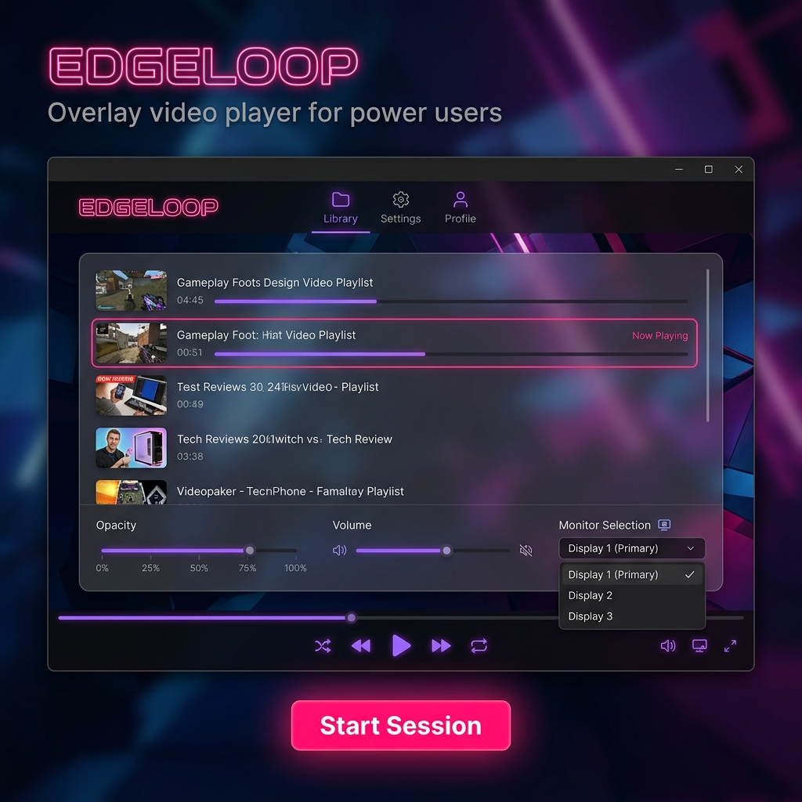

# 🌌 EdgeLoop

**EdgeLoop** is a high-performance video engine designed for multi-monitor setups. Built on a custom fork of `Flyleaf`, it provides seamless, transparent overlays directly on your desktop.

---

## 🚀 Key Features

### 🖥️ Advanced Multi-Monitor Management
*   **Targeted Playback**: Pin videos to specific displays or span them across your entire workspace.
*   **External Synchronization**: Multiple player instances follow a single master clock for frame-exact synchronization across monitors.

### 🔲 Transparent Graphics Pipeline
*   **DirectX 11 Rendering**: Custom pipeline that allows video windows to be truly transparent.
*   **Windowless Feel**: Run content as if it's part of your wallpaper.

### 🌐 Deep Web Integration
*   **Powered by yt-dlp**: Stream from 1000+ sites.
*   **Session Shield**: Safely store and inject cookies to unlock high-res streams.

### ⚡ Performance & Portability
*   **Smart Buffering**: Intelligent disk-caching for high-resolution content.
*   **Zero-Install**: Fully portable architecture. All data is kept in the `Data/` folder.
*   **Panic Mode**: Instant shortcut to wipe all active players from the screen.

## 🛠️ Technical Stack
*   **Engine**: Custom Flyleaf Fork (C# / WPF / DirectX 11)
*   **Media**: Internal FFmpeg shared libraries
*   **Extraction**: Integrated `yt-dlp`
*   **Platform**: .NET 10 (Windows x64)

## 📦 Installation & Setup

1.  **Requirements**: Ensure the [.NET 10 Desktop Runtime](https://dotnet.microsoft.com/download/dotnet/10.0-windows-desktop-runtime) is installed.
2.  **Download**: Get the latest bundle from the [Releases](https://github.com/experiment-peepo/EdgeLoop/releases) page.
3.  **Run**: Extract and launch `EdgeLoop.exe`.

### Site Authentication
For sites that require sessions:
1.  Open your browser and log in to the site.
2.  Open DevTools (`F12`), go to the Console, and run: `copy(document.cookie)`.
3.  In EdgeLoop, go to **Settings > Session & History** and click **Paste**.

## 🤝 Contributing
*   See [CONTRIBUTING.md](.github/CONTRIBUTING.md) for guidelines.
*   Check the [Roadmap](docs/Flyleaf_Fork_Roadmap.md) for planned features.

## 📜 License
Distributed under the **GPL-3.0 License**. See `LICENSE` for more information.

---
*Support the development on [Ko-fi](https://ko-fi.com/vexfromdestiny)*
